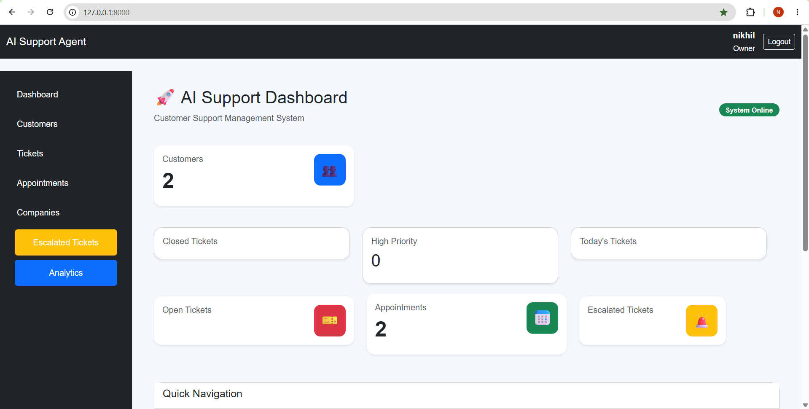
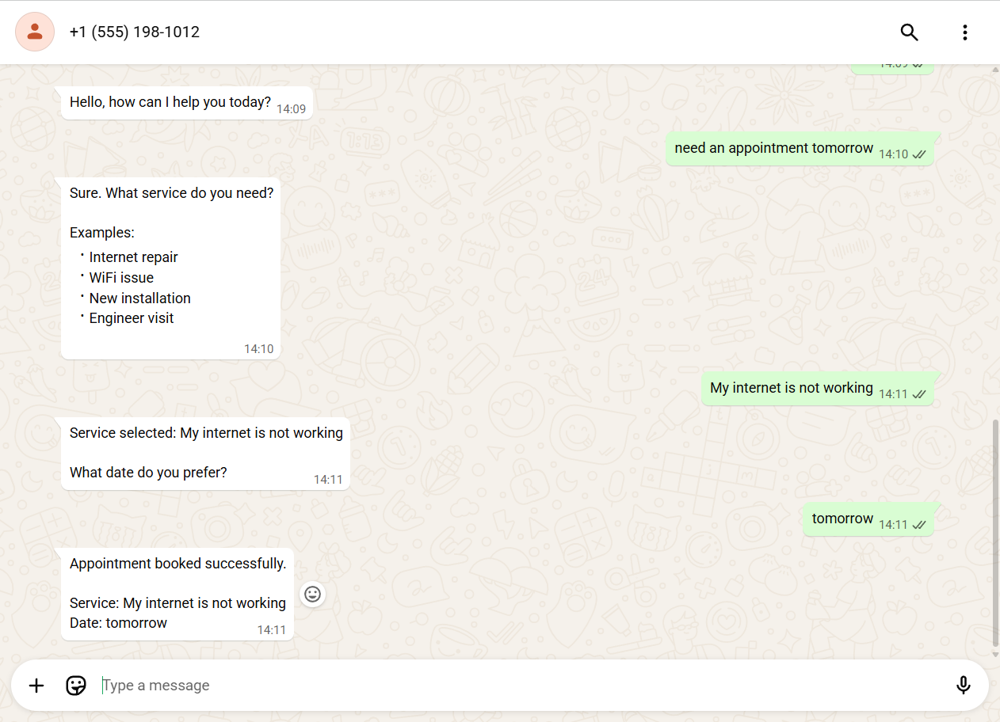
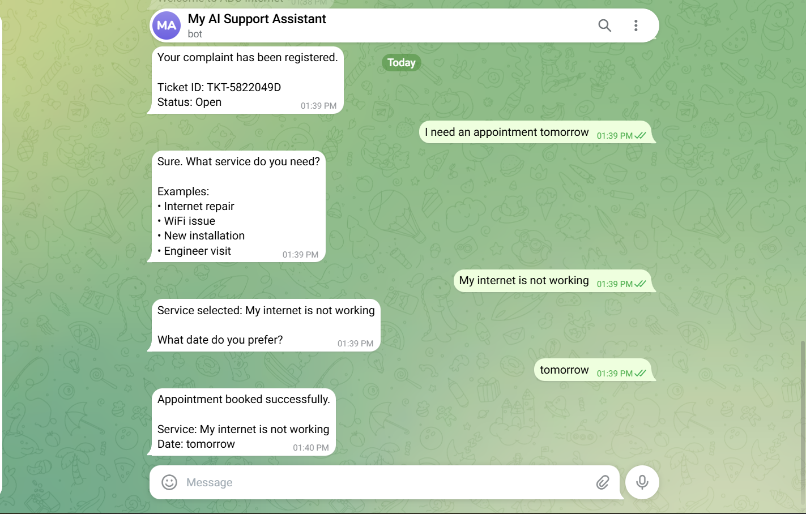

# AI Support Agent SaaS

> **An Enterprise Multi-Agent AI Customer Support Platform** built for modern service businesses.

> **Kaggle AI Agents: Intensive Vibe Coding Capstone Project**

---

## Overview

AI Support Agent SaaS is a production-oriented, multi-tenant AI agent platform that automates customer support across WhatsApp, Telegram, and a web dashboard.

Instead of using a single chatbot, the platform coordinates multiple specialized AI agents that collaborate to understand user intent, retrieve business knowledge, register complaints, schedule appointments, update customer records, and assist human operators when needed.

The platform demonstrates modern AI agent design using agent orchestration, tool calling, memory, security guardrails, deployable architecture, and human-in-the-loop workflows.

---

## Why AI Agents?

Traditional chatbots follow predefined flows.

This project demonstrates how collaborative AI agents can:

- Understand customer intent
- Decide which specialist agent should act
- Use external tools
- Maintain customer memory
- Escalate to humans when required
- Automate repetitive support operations

---

# Features

- Multi-agent workflow
- WhatsApp Cloud API integration
- Telegram Bot integration
- AI complaint registration
- Appointment booking
- Google Calendar integration
- Customer profiling and memory
- Ticket management
- Admin dashboard
- Multi-tenant SaaS
- Role-based access control
- Docker deployment
- Security guardrails

---

# Agent Architecture

```text
Customer
    │
WhatsApp / Telegram
    │
Gateway Agent
    │
Intent Agent
    │
Planner Agent
    │
 ├── Support Agent
 ├── Complaint Agent
 ├── Appointment Agent
 ├── Knowledge Agent
 └── Analytics Agent
    │
Tool Layer
    │
SQLite / PostgreSQL
Google Calendar
WhatsApp API
```

---

# AI Workflow

1. Customer sends a message.
2. Gateway Agent receives it.
3. Intent Agent classifies the request.
4. Planner selects the appropriate specialist.
5. Specialist agent calls business tools.
6. Customer memory is updated.
7. Human approval is requested when necessary.
8. Response is delivered.

---

# Memory

Each customer profile stores:

- Conversation history
- Complaint history
- Appointment history
- Sentiment
- Last activity
- VIP score

---

# Security

- Tenant isolation
- JWT authentication
- Role-based authorization
- Prompt validation
- Tool authorization
- Secure environment variables
- Audit-ready architecture

---

# Dashboard

Replace with your screenshots.

```markdown

```

---

# WhatsApp

```markdown

```

---

# Telegram

```markdown

```

---

# Google Calendar

```markdown

```

---

# Technology Stack

- Python
- FastAPI
- LangGraph
- Ollama
- Llama 3.2
- SQLite
- PostgreSQL
- Docker
- Redis
- JWT
- WhatsApp Cloud API
- Telegram Bot API

---

# Project Structure

```text
ai-support-agent/
├── auth/
├── graph/
├── services/
├── tools/
├── templates/
├── static/
├── tests/
└── docker/
```

---

# Installation

```bash
git clone <repository>
cd ai-support-agent
python -m venv venv
pip install -r requirements.txt
```

Run:

```bash
uvicorn admin_dashboard:app --reload
```

---

# Production Architecture

```text
Internet
   │
Nginx
   │
Docker
   │
FastAPI
   │
Redis
   │
PostgreSQL
   │
AI Agents
   │
WhatsApp / Telegram / Google Calendar
```

---

# Roadmap

- Voice agents
- Knowledge-base RAG
- Email integration
- Instagram integration
- Human takeover
- SLA monitoring
- AI summaries
- White-label branding

---

# License

copyright @NIKHIL_TYAGI not allowed commercial use.

---

## Acknowledgements

Built as a capstone project inspired by modern AI agent design patterns, demonstrating multi-agent orchestration, tool use, memory, secure workflows, and deployable architecture.
